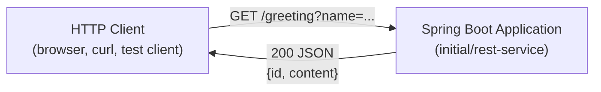

# Architecture: Display personalized greeting message

## Traceability

| Field | Value |
|-------|-------|
| Jira issue | SCRUM-3 |
| Requirements | docs/requirements.md (approved 2026-08-14) |
| Last updated | 2026-08-14 |

## Summary

Extend the existing Spring Boot REST service in the `initial/` Maven project with a single read-only greeting resource. A new `@RestController` handles `GET /greeting`, accepts an optional `name` query parameter, and returns a JSON `Greeting` record (`id`, `content`) produced from the template `Hello, {name}!`. The design follows the Spring REST service guide in the repository README and the reference implementation in `complete/`, with one explicit refinement: blank or whitespace-only `name` values normalize to `"World"` so behavior stays predictable and aligned with the guide's default semantics.

## Context



| Actor / system | Role |
|----------------|------|
| HTTP client | Sends GET requests with optional `name` query parameter |
| Spring Boot embedded Tomcat | Hosts the REST endpoint on port 8080 (default) |
| Jackson (via spring-boot-starter-webmvc) | Serializes `Greeting` record to JSON |

No authentication, database, message broker, or external integrations are in scope (per requirements out-of-scope list).

## Components

| Component | Responsibility | Requirement refs |
|-----------|----------------|------------------|
| `RestServiceApplication` | Spring Boot bootstrap; component scanning and auto-configuration for the web stack | FR-009, NFR-002 |
| `Greeting` (Java record) | Immutable response model holding `id` (long) and `content` (String); serialized to JSON by Jackson | FR-006, FR-007, FR-008 |
| `GreetingController` | Maps `GET /greeting`; resolves effective name (default/normalization); formats greeting; assigns monotonic `id` | FR-001–FR-005, FR-007, SEC-003 |
| `GreetingControllerTests` | Verifies default and personalized greeting behavior via `RestTestClient` | NFR-005, AC-006 |

### Layering

| Layer | Classes | Notes |
|-------|---------|-------|
| Application bootstrap | `RestServiceApplication` | Unchanged entry point in `initial/` |
| Web / API | `GreetingController` | Single REST controller; no service layer required for this story |
| Domain / representation | `Greeting` | Plain record; no persistence or business rules beyond formatting |

## Data design

N/A — no database or durable storage. Greeting `id` values are generated in-memory per JVM using an `AtomicLong` counter (ephemeral, non-persistent), consistent with the Spring guide baseline in `complete/`.

## Interfaces

### HTTP API

| Attribute | Value |
|-----------|-------|
| Method / path | `GET /greeting` |
| Query parameters | `name` (optional, String) |
| Success status | `200 OK` |
| Content-Type | `application/json` |
| Response body | `{ "id": <long>, "content": "<greeting text>" }` |

**Effective name resolution**

| Input | Effective name | Example `content` |
|-------|----------------|-------------------|
| Parameter omitted | `"World"` | `"Hello, World!"` |
| `name=Alice` | `"Alice"` | `"Hello, Alice!"` |
| `name=` (empty) or whitespace-only | `"World"` | `"Hello, World!"` |

**Greeting format:** `Hello, {effectiveName}!`

**Example requests**

```
GET /greeting
→ {"id":1,"content":"Hello, World!"}

GET /greeting?name=User
→ {"id":2,"content":"Hello, User!"}
```

Implementation contract for the controller:

```java
@GetMapping("/greeting")
public Greeting greeting(@RequestParam(required = false) String name) {
  String effectiveName = resolveName(name); // null, blank, or whitespace → "World"
  return new Greeting(counter.incrementAndGet(), template.formatted(effectiveName));
}
```

Spring MVC binds `name` as a plain String; no custom deserializers or third-party libraries are required (NFR-006).

### Internal contracts

| From | To | Contract |
|------|-----|----------|
| `GreetingController` | `Greeting` | Constructor: `(long id, String content)` |
| Spring MVC | `GreetingController` | Invokes handler; serializes return value to JSON |

## Security architecture

| Control | Approach | Requirement refs |
|---------|----------|------------------|
| No authentication | Endpoint is publicly accessible; no Spring Security filter chain or credentials required | SEC-001 |
| No sensitive data persistence | Request/response data is ephemeral; no logging of `name` beyond normal framework defaults; no database writes | SEC-002 |
| Safe display handling | `name` is concatenated into a greeting string only; never evaluated as code, SQL, or shell commands; returned as JSON string via Jackson escaping | SEC-003 |

Authentication and authorization remain explicitly out of scope. No additional security middleware is introduced.

## Non-functional approach

| Requirement | Design approach |
|-------------|-----------------|
| NFR-001 | Target `initial/pom.xml` already sets `<java.version>17</java.version>`; new classes use Java 17 records and `String.formatted` |
| NFR-002 | Use existing Spring Boot 4.x parent and `spring-boot-starter-webmvc`; add only `@RestController` and record types |
| NFR-003 | Build with Maven via existing `pom.xml`, wrapper scripts (`mvnw`), and `spring-boot-maven-plugin` |
| NFR-004 | All new types live in `com.example.restservice` alongside `RestServiceApplication` |
| NFR-005 | Add `GreetingControllerTests` under `src/test/java/com/example/restservice/` using `@SpringBootTest`, `@AutoConfigureRestTestClient`, and two test methods (default + personalized), mirroring `complete/` |
| NFR-006 | No new dependencies; reuse starters already declared in `initial/pom.xml` |
| NFR-007 | CI/local verification via `mvn test` from `initial/` directory |

## Key decisions

| Decision | Choice | Rationale | Alternatives considered |
|----------|--------|-----------|-------------------------|
| Implementation target | `initial/` Maven module | Requirements baseline is `initial/` (application only, no greeting yet) | Implement in `complete/` (rejected — already contains reference code; story targets incremental addition) |
| Response model | Java `record` with `id` and `content` | Matches README and `complete/Greeting.java`; minimal boilerplate | POJO class, Map-based response (rejected — breaks baseline pattern) |
| ID generation | In-memory `AtomicLong` counter in controller | Matches Spring guide; satisfies FR-008 without persistence | UUID, database sequence (rejected — out of scope) |
| Default `name` | `"World"` when parameter omitted | Required by FR-003; aligns with `@RequestParam(defaultValue = "World")` in guide | Custom default string (rejected — contradicts requirements) |
| Empty / blank `name` | Normalize to `"World"` | Resolves requirements open question; avoids `"Hello, !"`; consistent with guide intent for “default greeting” | Treat empty as literal empty name (rejected — poor UX, not specified in SCRUM-3) |
| Name validation | Minimal — optional String param only; no max length or charset rules | Resolves requirements open question; sufficient for display-only text (SEC-003); keeps scope minimal | Length limits, HTML stripping, profanity filter (rejected — not in requirements) |
| Architectural layering | Controller + record only (no separate service) | Single endpoint with trivial logic; matches guide and `complete/` structure | Dedicated `GreetingService` (rejected — unnecessary indirection for this story) |
| Testing style | `@SpringBootTest` + `RestTestClient` slice | Matches `complete/GreetingControllerTests`; validates HTTP contract end-to-end within JVM | Pure `@WebMvcTest` unit test (acceptable but guide uses full context test) |

## Requirement coverage

| Requirement ID | Architectural response |
|----------------|------------------------|
| FR-001 | `GreetingController` exposes `@GetMapping("/greeting")` |
| FR-002 | Optional `@RequestParam(required = false) String name` (or equivalent with default) |
| FR-003 | `resolveName()` returns `"World"` when parameter is absent |
| FR-004 | Supplied non-blank `name` is used verbatim in `Hello, {name}!` |
| FR-005 | Successful handler return produces HTTP 200 via Spring MVC defaults |
| FR-006 | `Greeting` record returned; Jackson serializes to JSON |
| FR-007 | `content` field set to `String.formatted("Hello, %s!", effectiveName)` |
| FR-008 | Monotonic `id` from `AtomicLong` assigned per greeting instance |
| FR-009 | New components are additive; `RestServiceApplication` unchanged; no new blocking beans |
| NFR-001 | Java 17 record and language features in `initial/` module |
| NFR-002 | Spring Boot `@RestController` and auto-configured web stack |
| NFR-003 | Maven project structure and plugins unchanged except new source files |
| NFR-004 | Package `com.example.restservice` for all new types |
| NFR-005 | `GreetingControllerTests` covers default and personalized scenarios |
| NFR-006 | Zero additional dependencies in `pom.xml` |
| NFR-007 | Architecture supports verification via standard Maven test lifecycle |
| SEC-001 | No security filters; public GET endpoint |
| SEC-002 | No persistence layer; ephemeral request/response only |
| SEC-003 | String interpolation only; Jackson JSON encoding for output |
| AC-001 | GET `/greeting` → JSON with `content` (FR-001, FR-005–FR-007) |
| AC-002 | Optional `name` query parameter on controller method |
| AC-003 | Default/normalized name yields `"Hello, World!"` |
| AC-004 | HTTP 200 on success |
| AC-005 | JSON body includes `content` and `id` |
| AC-006 | Test component validates both greeting paths |
| AC-007 | Maven build/test pipeline unchanged in structure |
| AC-008 | Bootstrap class unchanged; Spring component scan picks up new controller |

## Assumptions and dependencies

- Implementation occurs in the `initial/` directory (Maven), not Gradle or Kotlin variants, per approved requirements.
- Default embedded server port remains 8080 unless changed in a later phase.
- The `complete/` module serves as a behavioral reference only; Architecture does not modify it.
- Spring Boot 4.x and `spring-boot-starter-webmvc-test` / `RestTestClient` conventions from the existing `initial/pom.xml` apply.
- Blank-name normalization is implemented in controller logic (`resolveName`), not solely via `@RequestParam(defaultValue)`, because Spring treats `?name=` as present with an empty value.

## Open questions

- None blocking. Empty-name and validation topics from requirements are resolved in **Key decisions** above.
- *Optional follow-up (non-blocking):* If product owners later require rejecting overly long `name` values, add an NFR and revisit at Implementation Planning — not required for SCRUM-3.
